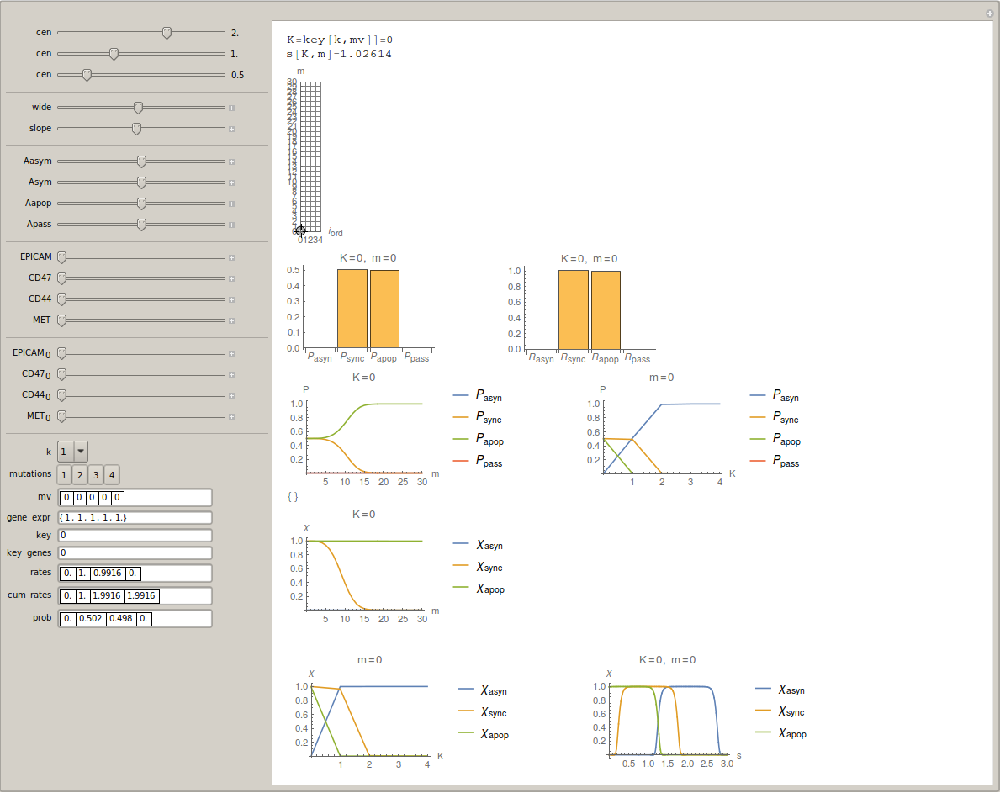
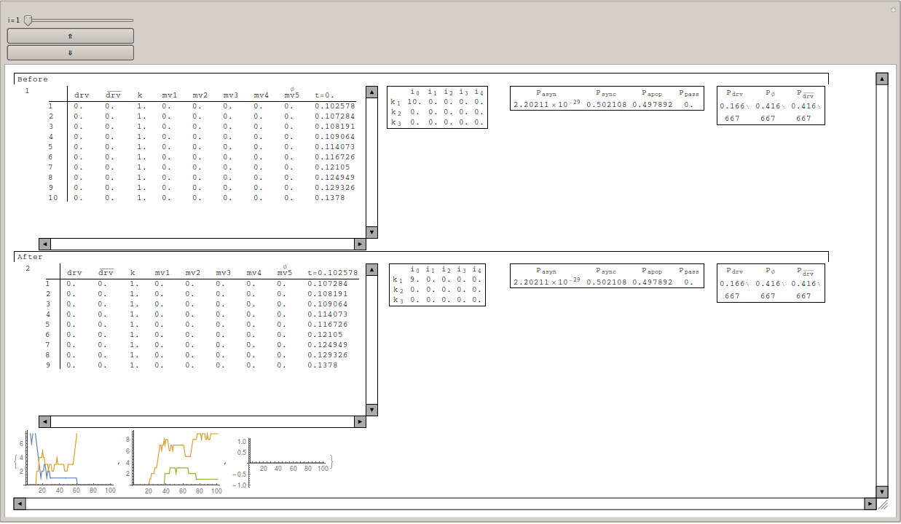
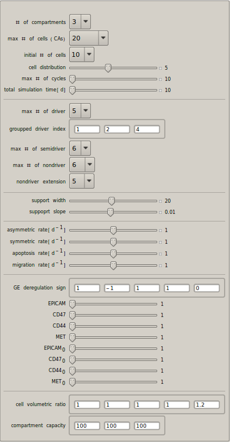
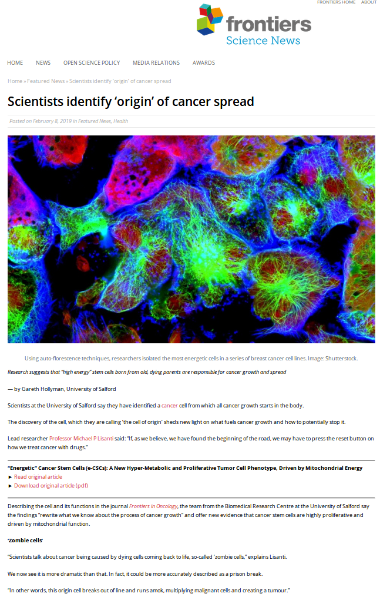

# Mutation Order Simulator
Mathematica code for simulating the evolution of populations of cancer cells subjected to driver, non-driver and metabolic mutations under various dynamic conditions. The underlying program is a CA model running large number of agents representing cenls moving in both the cell mutational space, and different hosting tissues.    

##### Requirements 
To run the simulator is required to install Mathematica 9.

##### Analysis and interface
Mathematica offers the possibility to create suitable interactive interfaces allowing the user to change the analytical and numerical parameters of an algorithm.
We have created a set of interfaces to study different aspects of cancer cell populations such as: analyzing the variation of cancer stemeness, dynamic evolutions of cell classes under different number of driver or metabolic mutations, activation/deactivation of costrainst given by the order of mutations, changing the effect of each driver mutation on the fitness of a cell, changing the number of cell populations simulated, and many other parameters depending on the gene expression and specific type of cancer.

##### Specific cases
Migration of Circulating Tumour Cells from the breast to the bone.

#### Authors
Gianluca Ascolan1 and Pietro Lio'

###### References
[“Energetic” Cancer Stem Cells (e-CSCs): A New Hyper-Metabolic and Proliferative Tumor Cell Phenotype, Driven by Mitochondrial Energy](https://blog.frontiersin.org/2019/02/08/scientists-identify-stem-cell-origin-of-cancer-spread/)

